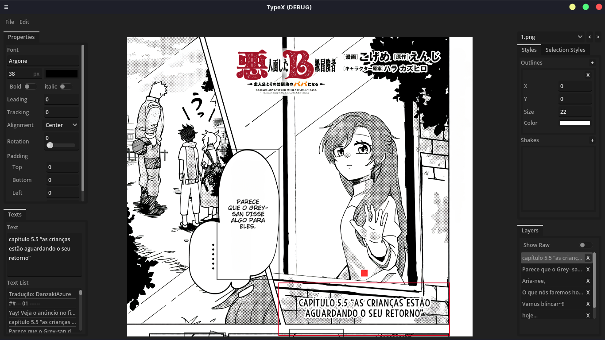
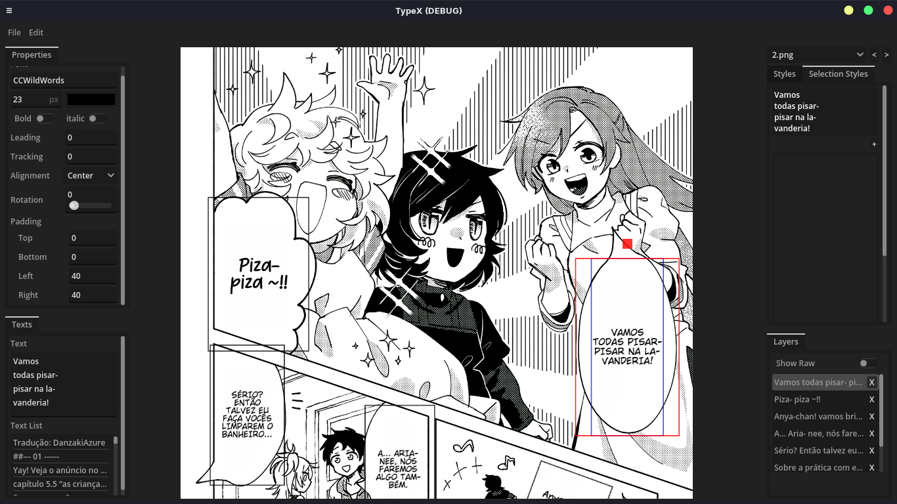
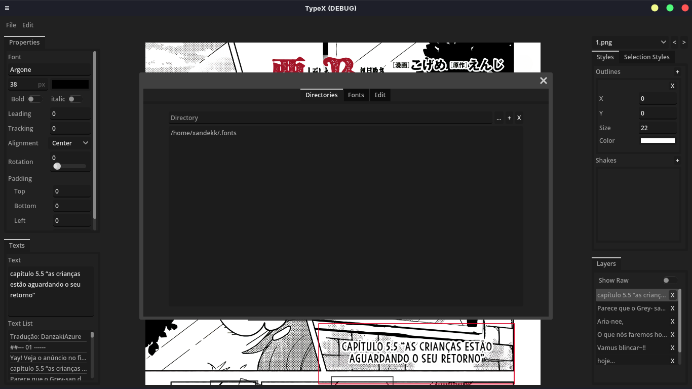
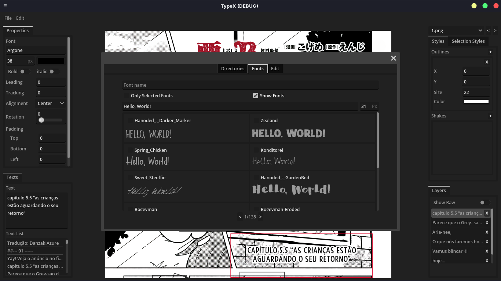
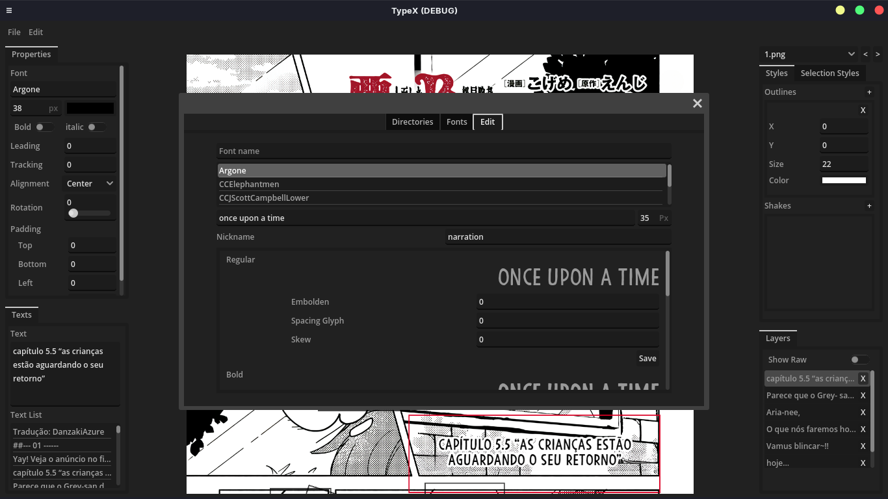

# TypeX

**Coming soon in PT-BR**

**[Description](#description) | [Key Features](#key-features) | [Upcoming Features](#upcoming-features) | [Screenshots](#screenshots) | [Videos](#videos) | [Installation](#installation) | [How to Use](#how-to-use) | [Contribution](#contribution) | [License](#license)** 

## Description

TypeX is an application designed to streamline the typesetting process in *Manga*, *Manhwa*, *Manhua*, and *Comics*, providing a lightweight and efficient experience.

## Key Features

### Font Management

- Customize your font choices and adjust properties according to your preference.

### Text List

- Access a text list to simplify the process, eliminating the need to switch between different applications.

### Other Features

- Incorporates advanced features such as outlines and shakes, offering a powerful set of tools to enhance your work.

### Upcoming Features:

- Transform
- Gradient
- Blur
- Pattern
- Mask
- AI
- Curve text
- And much more...

## Screenshots

### Overview

### Font Management

## Videos

https://github.com/XandeKK/TypeX/assets/80427458/8c8d7c90-d692-4097-956b-1826dc9bf8c0

https://github.com/XandeKK/TypeX/assets/80427458/78958caf-8019-4d00-b5de-7e52cb0a4dd2

https://github.com/XandeKK/TypeX/assets/80427458/f6078f5c-57d7-4e90-b83d-5a167f4b891c

## Installation

[**Click Here**](https://github.com/XandeKK/TypeX/releases/tag/v0.1.0-alpha)

Dear users,
When downloading the alpha release of TypeX, please choose the file that matches your system's architecture:

- **TypeX.arm32**: For systems using a 32-bit ARM architecture.
- **TypeX.arm64**: For systems using a 64-bit ARM architecture.
- **TypeX.x86_32**: For systems using a 32-bit x86 architecture.
- **TypeX.x86_64**: For systems using a 64-bit x86 architecture.
- **TypeX_x86_32.exe**: For Windows systems using a 32-bit x86 architecture.
- **TypeX_x86_64.exe**: For Windows systems using a 64-bit x86 architecture.

Please download the file that corresponds to your system. If you're unsure about your system's architecture, you may need to check your system information.

Thank you for your support!

## How to Use

[**Click Here**](https://github.com/XandeKK/TypeX/wiki/How-to-Use-the-TypeX)

## Contribution

**Coming soon**

## License

This project is licensed under the GPL-3.0 license - see the [LICENSE](https://github.com/XandeKK/TypeX#GPL-3.0-1-ov-file) file for details.
